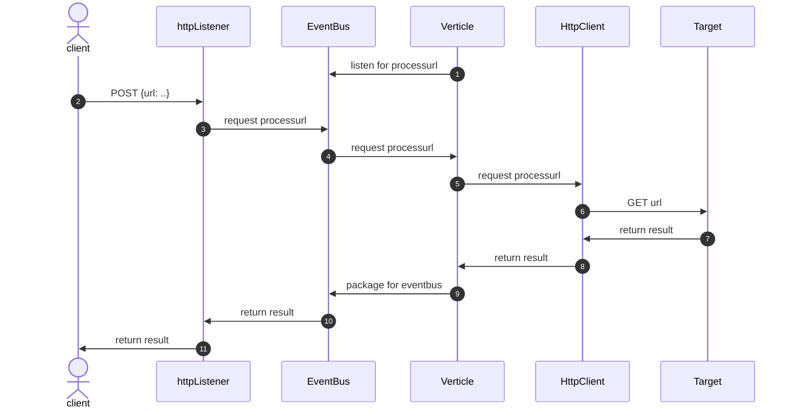

# Quarkus Proxy Sample

Reactive Quarkus app (Java 21) that accepts `POST /proxy` with JSON `{"url": "https://..."}`, dispatches to a Vert.x EventBus address `processurl`, fetches the target URL via Vert.x WebClient, and returns status, headers, and body.

## Run (dev)

```sh
mvn quarkus:dev
```

## Example

```sh
curl -sS -X POST http://localhost:8080/proxy \
  -H 'content-type: application/json' \
  -d '{"url":"https://httpbin.org/get"}' | jq
```

## Build

```sh
mvn -DskipTests package
```

## Endpoints

- `POST /proxy` JSON body: `{ "url": "https://example.com" }`

## EventBus

- Address: `processurl`
- Message flow: resource `ProxyResource` -> `UrlProcessorVerticle` -> HTTP fetch -> reply with `ProxyResult`.

## sequence


